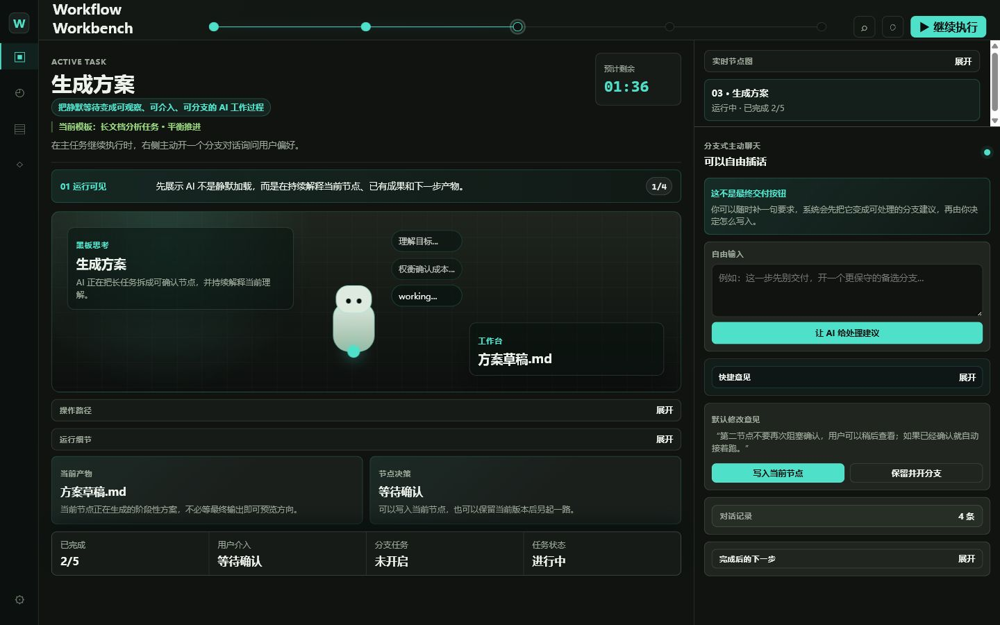

# AI 长任务运行台 Demo

[](https://github.com/hummmmmm122-ui/ai-long-task-runtime-demo/actions/workflows/pages.yml)

这是一个 AI 长任务运行台的产品原型 Demo，主题来自 PRD 中的核心问题：当 AI 执行长耗时任务时，用户不能只看到一个安静的等待状态，而应该持续知道 AI 在做什么、已经产出了什么、接下来会产出什么，以及自己是否可以中途介入。

Demo 不追求完整后端能力，重点是把“等待过程重构”为可观察、可介入、可分支的任务 runtime。

## 在线体验

[打开在线版本](https://hummmmmm122-ui.github.io/ai-long-task-runtime-demo/)



预览图展示的是运行中的任务工作台：AI 正在执行 `生成方案` 节点，用户可以查看事件详情、输入临时介入意见，并在保留 V1 的同时开启 V2 分支。

本地快速启动：

```bash
npm install
npm run dev
```

如果页面暂时还打不开，请到仓库的 `Actions` 页面确认 `Deploy demo to GitHub Pages` 是否已经运行完成，并在仓库 `Settings -> Pages` 中选择 GitHub Actions 作为发布来源。

## 项目思考

PRD 里最关键的痛点不是“AI 慢”，而是“AI 慢的时候用户失去参与感和控制感”。传统聊天界面在用户发出任务后，通常只剩下一个加载态。用户不知道 AI 是在理解目标、检索资料、生成方案，还是已经卡住；也不知道现在打断会不会浪费已有结果。

所以这个 Demo 把等待态拆成三个可用的产品能力：

- **实时节点图**：把长任务拆成可见节点，让用户知道当前执行到哪一步、哪些节点已经完成、哪些节点等待确认。
- **运行事件流和阶段产物**：不等最终答案才交付价值，而是在过程中持续展示执行事件、阶段性产物和下一步产物。
- **分支式主动聊天**：主任务继续运行时，右侧主动向用户询问偏好、接收修改意见，并允许采纳到当前节点或保留当前版本后开启新分支。

这个设计的目标是把“等待”变成一个可观察、可参与、可调整的工作过程。

## 产品路径

当前页面可以直接按真实任务运行路径体验：

1. 进入默认的 `生成方案` 运行态，查看顶部进度、运行事件流、右侧节点图和主动聊天。
2. 点击运行事件流中的任意事件，查看该步骤的证据和处理详情。
3. 点击 `查看检查点`，展开当前 artifact/checkpoint 的阶段性内容。
4. 使用 `确认当前节点` 或 `标记需复核`，验证节点不是只读状态，而是可以被用户决策。
5. 在右侧 `临时介入` 输入框补充约束，确认用户可以在主任务不暂停的情况下继续参与。
6. 点击右侧 `采纳到当前节点`，确认用户意见可以被吸收进当前任务，而不是只能等待最终结果。
7. 点击 `保留并开分支`，确认当用户希望改动已完成节点时，可以保留当前版本并开启新分支。
8. 查看 `V1 / V2 对比`，确认系统能解释当前版本和新分支的差异。
9. 点击顶部 `继续执行`，任务进入后续节点，节点状态和主面板内容同步变化。

项目辅助材料：

- [最终交付说明](docs/final-delivery.md)：集中查看在线地址、仓库地址、验证状态和范围边界。
- [运行导览图](docs/demo-map.md)：快速理解项目主线和核心流程。

## 功能范围

已实现：

- 深色轻量工作台界面
- 运行队列 / 任务中心切换
- 队列任务详情面板
- 队列任务稍后处理 / 恢复处理
- 模板库视图
- 模板套用状态
- 资源库 / 产物详情视图
- 运行设置视图
- 设置驱动的插话、分支和交接护栏
- 顶部任务进度线
- 实时节点图
- 当前节点详情
- 可点击运行事件流
- Artifact / checkpoint 展开
- 当前节点确认和需复核标记
- 已有成果、预期成果、风险提示
- 分支式主动聊天
- 临时介入输入
- 采纳用户修改
- 保留当前版本并开启分支
- V1 / V2 分支对比
- 状态化阶段摘要
- 任务继续执行
- 聚焦视图切换

未实现：

- 真实 AI 后端调用
- 真实任务执行队列
- 多会话持久化
- 用户登录和权限
- 真实节点回滚和版本 diff

## 技术实现

技术栈：

- React
- TypeScript
- Vite
- CSS

主要文件：

- `src/App.tsx`：任务 runtime 状态、节点数据和页面结构
- `src/runtimeModel.ts`：节点状态、事件流、artifact 和阶段摘要的核心规则
- `src/runtimeModel.test.ts`：核心 runtime 规则测试
- `src/App.test.tsx`：页面级关键交互测试
- `src/styles.css`：工作台视觉、响应式布局和运行态动画
- `src/main.tsx`：React 入口
- `docs/final-delivery.md`：最终交付说明
- `docs/demo-map.md`：运行导览图和产品理解路径

## 本地运行

```bash
npm install
npm run dev
```

默认访问：

```text
http://localhost:5173/
```

如果端口被占用，Vite 会自动提示新的本地地址。

## 构建验证

```bash
npm test
npm run build
```

## GitHub Pages 部署

项目已内置 `.github/workflows/pages.yml`。推送到 `main` 后，GitHub Actions 会先执行 `npm test`，再构建 `dist` 并部署到 GitHub Pages。

## 设计取舍

这个项目刻意做成“产品原型 demo 的最小闭环”，而不是完整生产系统。PRD 中提到的节点编辑、确认节奏、回退/分支、主动下一步建议，都被压缩到一个单页里，目的是先验证 AI 长任务 runtime 的交互形态。

如果继续扩展，优先方向会是：

- 接入真实任务执行事件流
- 为每个节点增加可编辑详情和确认状态
- 增加节点回滚和分支版本对比
- 把运行事件流做成可折叠详情面板
- 将主动聊天生成的新建议一键开启为新会话
