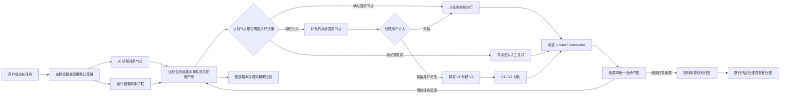

# 产品导览图

这张图用于说明 AI 长任务运行台的产品闭环：它不是一个更漂亮的 loading，而是把 AI 的长时间执行过程变成可观察、可介入、可确认、可分支、可管理的工作台。

## 核心能力

- **可观察**：运行事件流展示 AI 当前做了什么、依据是什么、下一步会做什么。
- **可确认**：用户可以确认当前节点，也可以标记为需复核。
- **可介入**：用户可以在主任务不暂停的情况下补充临时约束。
- **可分支**：系统可以保留当前版本 V1，并把新意见放入 V2 分支，后续对比差异。
- **可管理**：运行队列可以处理多个长任务，支持稍后处理和恢复处理。
- **可复用**：模板库把常见长任务沉淀为节点预设和运行策略。
- **可追溯**：资源库收纳 artifact、checkpoint 和外部任务资源，并能跳回来源任务。
- **可配置**：运行设置控制插话、分支和交接摘要等护栏。

## 当前页面对应关系

- 左侧导航：任务中心、运行队列、模板库、资源库、运行设置。
- 顶部栏：任务进度、快速搜索、运行提醒、继续执行。
- 主工作区：当前节点、运行事件流、artifact / checkpoint、节点决策、V1 / V2 对比。
- 节点图：显示每个节点的完成、运行、等待、待确认或分支状态。
- 右侧主动聊天：承接用户临时介入、采纳到当前节点、保留并开分支。
- 队列视图：展示多任务状态、当前产物、下一步动作、稍后处理和恢复处理。
- 模板视图：展示长文档、多轮方案、调研摘要等任务预设，并同步运行策略。
- 资源视图：展示草稿、checkpoint 和外部资源，并跳转到来源队列任务。
- 设置视图：控制确认节奏、插话入口、自动分支和阶段摘要。
