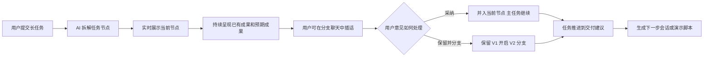

# 演示导览图

这张导览图用于在演示前 10 秒说明项目主线：这个 demo 不是做一个更好看的 loading，而是把 AI 长任务的等待过程变成可观察、可参与、可调整的工作过程。

## 演示时要强调的 3 个关键词

- **已接收**：AI 不只是显示加载动画，而是明确告诉用户任务已被理解并拆成节点。
- **处理中**：每个节点都有当前动作、已有成果、预期成果和风险提示。
- **可介入**：用户可以中途补充偏好，选择采纳到当前节点，或保留当前版本后开启新分支。

## 观众应该看到什么

1. 左侧主舞台展示 AI 正在执行的二维运行态，降低“是不是卡住了”的不确定感。
2. 中间节点详情展示当前已经做出的阶段性成果，而不是等最终结果才给反馈。
3. 右侧分支聊天展示用户可以在等待中继续参与，且不会打断主任务。
4. 完成态继续给出下一步建议，让长任务自然接到新的行动。

## 一句话总结

这个 demo 验证的是一种新的 AI 产品交互：当任务需要较长时间时，系统应该把等待时间转化为可理解、可反馈、可继续推进的协作空间。
