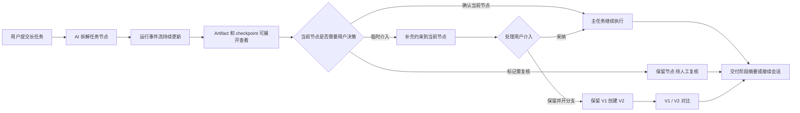

# 产品导览图

这张图用于说明 AI 长任务运行台的产品闭环：它不是一个更漂亮的 loading，而是把 AI 的长时间执行过程变成可观察、可介入、可确认、可分支的工作台。

## 核心能力

- **可观察**：运行事件流展示 AI 当前做了什么、依据是什么、下一步会做什么。
- **可确认**：用户可以确认当前节点，也可以标记为需复核。
- **可介入**：用户可以在主任务不暂停的情况下补充临时约束。
- **可分支**：系统可以保留当前版本 V1，并把新意见放入 V2 分支，后续对比差异。
- **可接续**：任务完成后给出阶段摘要和继续会话入口，而不是只停在完成状态。

## 当前页面对应关系

- 左侧主工作区：当前节点、运行事件流、artifact/checkpoint、节点决策、V1/V2 对比。
- 中间节点图：显示每个节点的完成、运行、等待、待确认或分支状态。
- 右侧主动聊天：承接用户临时介入、采纳到当前节点、保留并开分支。
- 底部状态条：汇总完成数量、用户介入、分支任务和任务状态。
